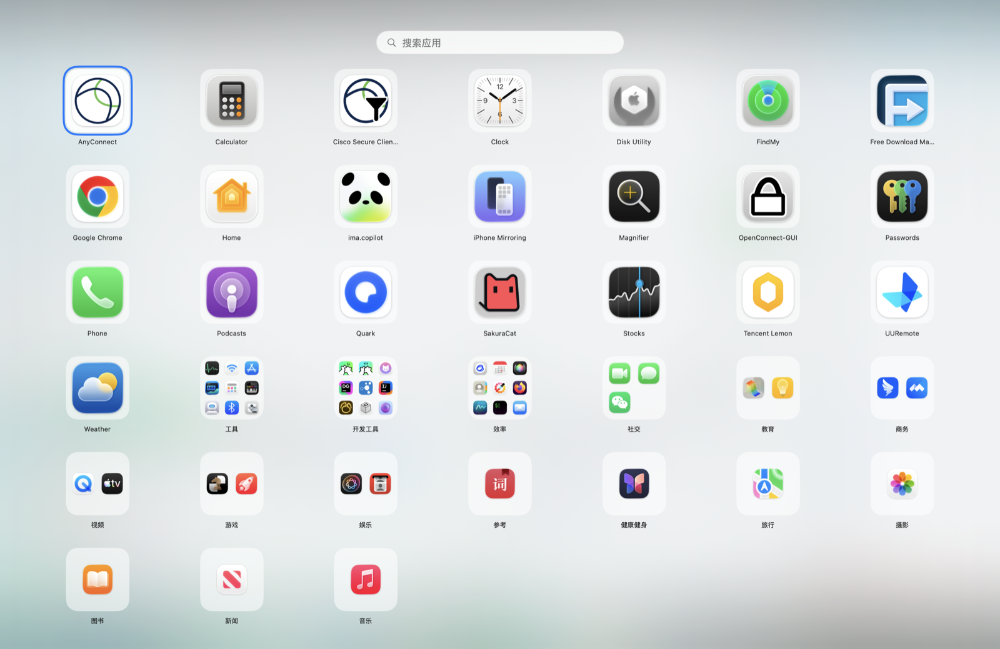
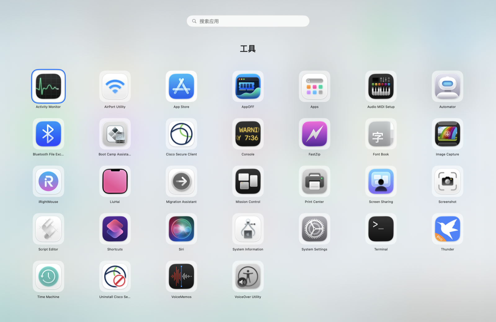
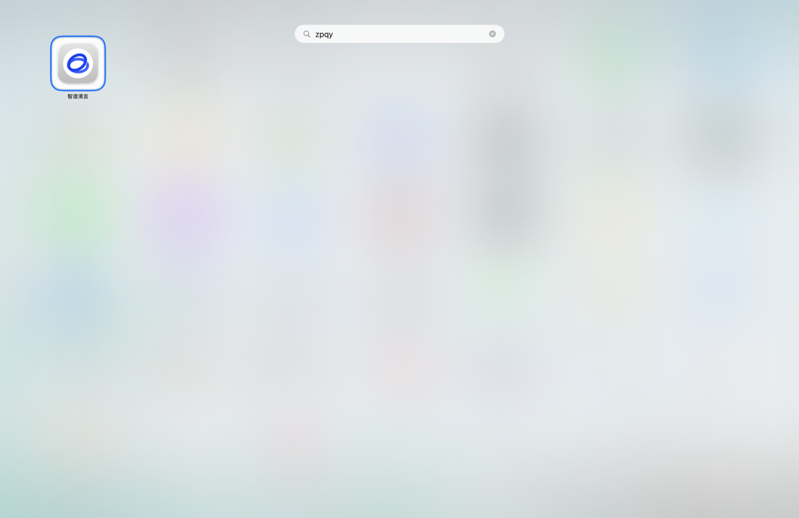
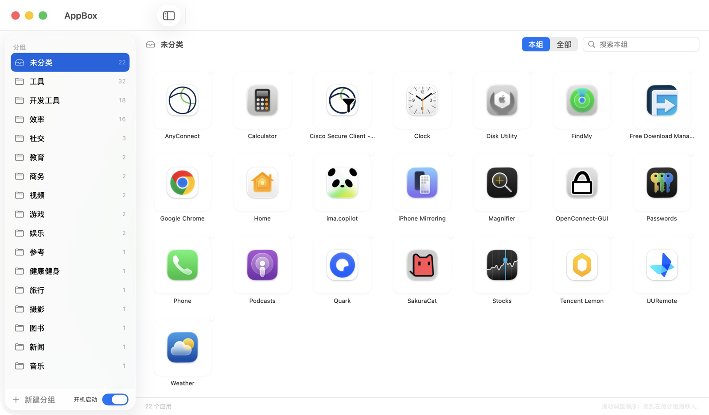
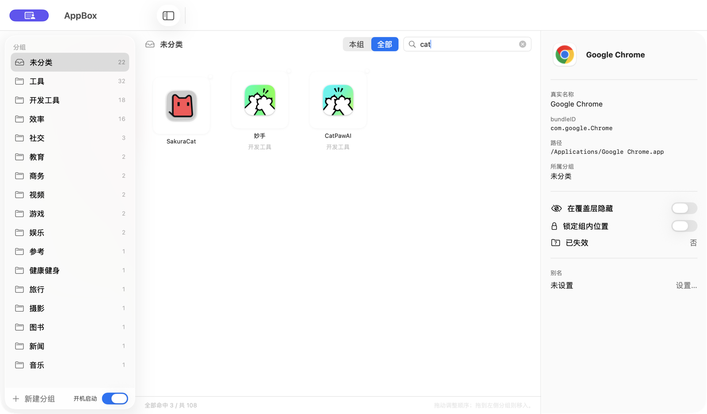
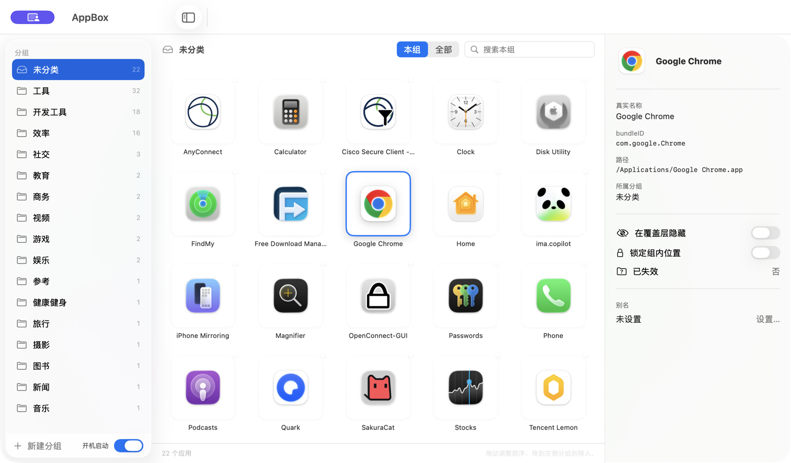

<div align="center">
  
  <h1>AppBox</h1>
  <p>
    <strong>macOS 全屏启动台 + 应用整理控制台</strong>
  </p>
  <p>
    
    
    
    
    
  </p>
  <p>中文 · <a href="README.en.md">English</a></p>
</div>

## 这是什么

macOS 26 (Tahoe) 移除了系统自带的 Launchpad，替代它的是 Spotlight 里的「Apps」视图——只能把应用平铺成一长列，**不能自定义分组**，也没地方给单个应用改名、隐藏或固定位置。应用装得越多，越难一眼看清「我的应用被组织成了什么样」。

**AppBox 补上这个缺口**：一个常驻后台的普通应用，按下全局热键就唤起铺满整屏的启动台覆盖层，另有一个控制台窗口负责所有配置。它只管理**展示层**——分组、别名、隐藏、排序——绝不修改、移动或删除磁盘上的任何应用文件。

| 界面 | 职责 | 唤起方式 |
|---|---|---|
| **覆盖层 (Overlay)** | 浏览与启动应用 | 全局热键 ⌥+Space，铺满鼠标所在屏幕 |
| **控制台 (Console)** | 配置的唯一写入场所 | 点击 Dock 图标 |

## 功能截图

### 覆盖层

分组以「文件夹方块」呈现，方块里摆组内前 9 个应用的缩略图标；未分类的应用以单个图标直接平铺在同一个网格里。蓝色环是当前键盘高亮项。



单击（或高亮后按回车）任一文件夹方块，展开为该组的子网格；点击空白处或按 Esc 回到顶层。



### 搜索

直接在覆盖层上敲字符，搜索框自动获得焦点并实时筛选。匹配范围是**全部应用（跨分组）**，结果平铺不分组；命中规则覆盖真实名、中文名、别名、bundleID 与**拼音首字母**——下图输入 `zpqy` 命中「智谱清言」。



### 控制台

左侧是分组列表（带组内应用数），右侧是所选分组的应用网格；底部可新建分组、开关开机启动。



把顶部的搜索范围切到「全部」即可跨分组过滤，结果里每个应用下方标出自己的归属分组。



单击任一应用，右侧滑出详情面板：真实名称、bundleID、路径、所属分组，以及隐藏 / 锁定 / 别名三项操作。



## 功能详解

### 应用发现与同步

- 扫描 `/Applications`、`/System/Applications`、`~/Applications` 及其一级子目录里的 `.app`，忽略应用包内部的嵌套 `.app`（不会把 Helper 当成应用）。
- 以 **bundleID 为主键**识别应用；极少数不声明 bundleID 的应用退回用绝对路径作主键。
- 同一 bundleID 有多个副本时只保留一个，优先级 `/Applications` > `/System/Applications` > `~/Applications`。
- 新发现的应用自动归入「未分类」。
- **FSEvents 监听目录**：新装的应用不用重启就能看到；被卸载的应用配置保留并标记为「失效」，从覆盖层消失、在控制台可见可清理。
- 图标经 `NSWorkspace` 提取后缓存为磁盘 PNG（按 bundleID + 应用包修改时间失效），二次启动不重新提取。
- 「最近已知路径」每次扫描刷新，应用被挪了位置照样能启动。

### 覆盖层

- ⌥+Space 唤起，铺满**鼠标当前所在**的那块屏幕，盖住所有窗口；再按一次或按 Esc 收起。
- 单击应用即启动并自动收起；应用已在运行时激活已有实例，不新开。
- 方向键移动高亮，回车启动/展开。
- 直接敲字符进入搜索，支持中文名、英文名、别名、bundleID、拼音首字母。
- 覆盖层内可拖拽整理：组内拖拽改顺序、拖到分组方块上即移入该组、在分组子网格里拖到空白处退回「未分类」、顶层拖方块调整分组顺序。
- 条目超出单屏网格容量时纵向滚动，不丢条目。
- 关闭覆盖层时不抢焦点回弹，避免闪一下。

### 控制台

- **分组**：新建、重命名、删除、拖动排序；删除分组时组内应用全部落回「未分类」，不丢应用；「未分类」不可删除也不可重命名；空分组保留不自动删。
- **单应用**：设置/清除别名、隐藏与恢复、锁定组内位置（锁定后不被自动排序挤走）、查看真实名称 / bundleID / 路径 / 归属 / 隐藏与失效状态。
- **失效应用**：只有真的存在失效记录时，侧栏才出现「维护 → 失效应用」这一栏，可逐条清理。
- **搜索**：本组过滤 / 全组过滤，规则与覆盖层同一套（含拼音），实时命中数显示在底部。
- **开机启动**：通过 `SMAppService` 注册登录项，开关状态读系统真值——注册失败时开关会弹回，界面不说谎。
- 关闭控制台窗口不退出程序，热键继续可用；退出用 ⌘Q。

### 引导整理（首次启动）

配置文件不存在时，控制台自动进入引导整理向导：按系统 `LSApplicationCategoryType` 推导出分组建议，每条可改名、与其他组合并、删除或跳过，未声明类别的应用归入「未分类」。**用户确认之前一个字节都不写**；直接关掉向导则什么都不写，下次启动再来。

### 配置与方案

- 配置写在 `~/Library/Application Support/AppBox/<方案名>.json`，一个方案一个文件，人类可读、可手改、可拷走备份。
- 自带 `schemaVersion`（当前 v2）：新增字段在解码时给默认值，不抬版本号；只有会让旧文件读错的变更才 +1 并补迁移。版本比当前代码新时**拒绝写入**，避免降级后随手改个设置就把新字段抹掉。
- 读入边界会做一次 `normalized()` 修复：补齐「未分类」、把指向已删除分组的应用落回「未分类」、清除纯空白别名。
- 图标缓存与配置物理分离（`icons/` 子目录），保证配置文件始终轻量。

## 架构

全部领域逻辑关在一个不依赖 AppKit 的模块里，让测试有唯一而稳定的靶心。

```
AppBoxCore   SwiftPM library · 零 AppKit 依赖
  ├── 领域模型        AppRecord / Group / AppBoxConfig / ApplicationConfig
  ├── LibraryService  唯一门面：快照查询 + 全部变更操作
  ├── LibrarySnapshot 渲染就绪的快照（分组方块、瓦片、失效列表）
  ├── 持久化          AppBoxConfigStore：JSON 编解码、schema 版本、方案
  ├── 搜索            AppSearch：多字段 + 拼音首字母
  ├── 覆盖层状态机    OverlayModel / OverlayDrop / GhostDropGuard / Geometry
  ├── 引导整理        SetupAdvisor / SetupWizardModel
  └── 端口 protocol   AppScanning · IconProviding · Launching · Watching · LoginItemControlling
                         ↓ 外层注入真实实现，测试注入假实现
AppBox       SwiftPM executable · SwiftUI + AppKit
  ├── 覆盖层窗口      OverlayWindow / OverlayView / OverlayController（层级、焦点、多屏判定）
  ├── 全局热键        Carbon RegisterEventHotKey
  ├── 系统实现        AppScanner / IconCache / WorkspaceLauncher / FSEventsWatcher / LoginItem
  └── 控制台 UI       ConsoleView / ApplicationInspector / MissingApplicationsView / SetupWizardView
```

**测试只打 `LibraryService` 这一个接缝。** 扫描、图标、启动、文件监听、登录项都是注入的端口，测试用假实现（`FakePorts.swift`）替换，因此 291 个领域测试不需要 AppKit、不需要真实 UI、不需要真实文件系统，0.7 秒跑完。

不做自动化测试、靠手工验证清单覆盖的部分：覆盖层窗口的层级与焦点、全局热键注册、真实图标提取、真实应用启动、FSEvents 触发、控制台交互。

## 关键设计决策

| ADR | 决策 | 理由 |
|---|---|---|
| [0001](docs/adr/0001-swiftui-swiftpm.md) | SwiftUI + SwiftPM，脚本组装 `.app`，不用 `.xcodeproj` | 工程文件难 diff；SwiftPM 包照样能用 Xcode 打开做预览与调试 |
| [0002](docs/adr/0002-归属制分组.md) | 分组采用归属制，一个应用只属于一个分组 | 拖拽语义无歧义，数据结构更简单 |
| [0003](docs/adr/0003-bundleid-主键.md) | bundleID 为主键，路径仅作定位 | 应用被移动或重命名后配置不应失效 |
| [0004](docs/adr/0004-控制台只管理展示层.md) | 控制台只管展示层，不提供卸载 | 定位是「整理与启动」而非软件管理器，权限需求保持最小 |
| [0005](docs/adr/0005-配置用-json.md) | 配置用 JSON 文件，不用数据库 | 几十 KB 数据用不上 SQLite；纯文本可手改可备份，一个方案一个文件 |
| [0006](docs/adr/0006-只做全局快捷键不做手势.md) | 只做全局热键，不接管触控板捏合 | 捏合手势要靠 `CGEventTap` + 辅助功能权限，且可能被 Dock 抢占 |

完整术语定义见 [CONTEXT.md](CONTEXT.md)，需求与验收标准见 [docs/specs/2026-09-26-appbox-启动台.md](docs/specs/2026-09-26-appbox-启动台.md)。

## 实现进度

已落地：项目骨架与打包、全局热键与覆盖层窗口、应用扫描去重与图标缓存、配置持久化与 schema 校验、分组模型与「未分类」保护、文件夹方块与子网格、键盘导航、搜索与拼音、控制台与分组管理、单应用管理与失效列表、覆盖层内拖拽整理、FSEvents 增量同步、引导整理向导、开机启动、控制台全组搜索。

尚未实现（对应 `.scratch/AppBox/tickets/` 里的 013 / 016 / 017）：

- 全局设置页：唤起热键可改、网格行列与图标尺寸可调、背景模糊度可调（目前热键固定 ⌥+Space、网格固定 7 列 × 96pt）
- 配置导出 / 导入 UI 与多方案切换 UI（存储层已支持一个方案一个 JSON 文件，界面还没接上）
- 性能指标的正式验证与调优（实测本机 108 个应用全量扫描约 0.09 秒）

明确不做：卸载应用、触控板捏合手势、自定义图标、覆盖层右键菜单、标签制多归属分组、Spotlight 全盘补扫、多屏同时覆盖、菜单栏图标、批量启动、使用频率统计、代码签名与公证、iOS 版本、云端同步。

## 快速开始

### 环境要求

- macOS 14 及以上（开发机为 macOS 26 Tahoe / arm64）
- Swift 6 工具链：Xcode 或仅 CommandLineTools 都可以，全程不需要 `.xcodeproj`

### 构建

```bash
swift build                              # 调试构建
swift build -c release                   # 发布构建
Configuration=release ./scripts/build-app.sh   # 编译 + 组装 dist/AppBox.app
open dist/AppBox.app                     # 启动，按 ⌥+Space 唤起覆盖层
```

`scripts/build-app.sh` 负责 SwiftPM 不管的部分：bundle 目录结构、`Info.plist`、`LC_BUILD_VERSION` 的 SDK 版本修正（不修的话 SwiftUI 的 `.draggable` 起不了拖拽会话）、以及 ad-hoc 临时签名。

### 打包 DMG

```bash
./scripts/build-dmg.sh        # 产物：dist/AppBox-0.1.0.dmg（含 Applications 快捷方式）
```

### 测试

```bash
swift test                    # 291 个测试 / 44 个 suite，约 0.7 秒
```

### 调试命令

打包好的二进制带三个不进 UI 的命令行入口，便于在终端里直接看状态：

```bash
dist/AppBox.app/Contents/MacOS/AppBox --scan            # 打印扫描到的应用、bundleID、目录与类别
dist/AppBox.app/Contents/MacOS/AppBox --config          # 打印配置目录、方案文件与加载结果
dist/AppBox.app/Contents/MacOS/AppBox --show-overlay    # 启动 2 秒后直接唤起覆盖层
```

### 数据位置

| 内容 | 路径 |
|---|---|
| 配置（一个方案一个文件） | `~/Library/Application Support/AppBox/default.json` |
| 图标缓存 | `~/Library/Application Support/AppBox/icons/` |

## 权限

不需要「辅助功能」权限，也不需要任何 TCC 授权：全局热键走 Carbon `RegisterEventHotKey`，应用扫描只读公开目录，启动走 `NSWorkspace`。应用是常规应用（保留 Dock 图标），不是 `LSUIElement` 代理程序。
